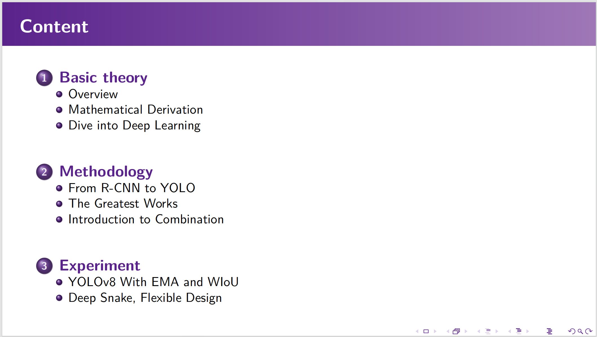
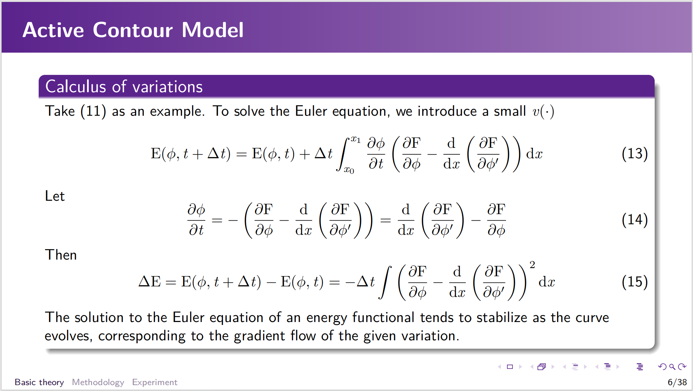
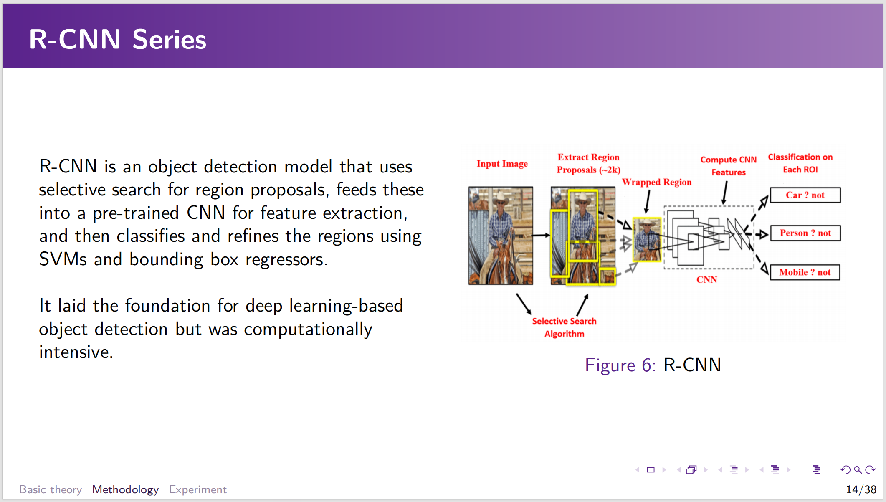
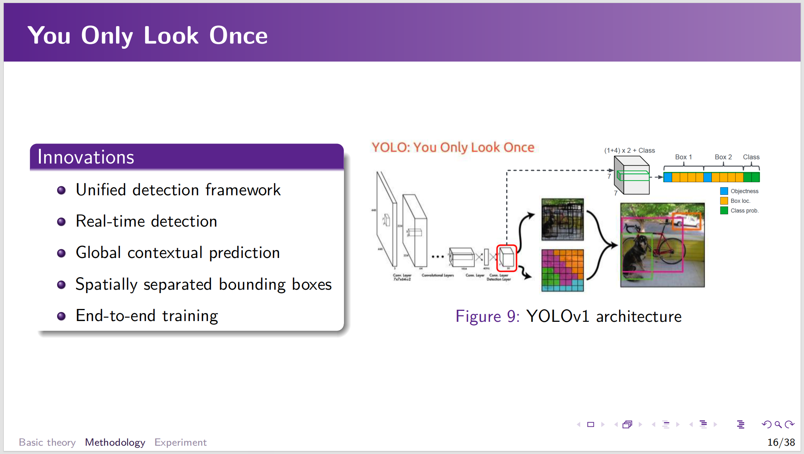
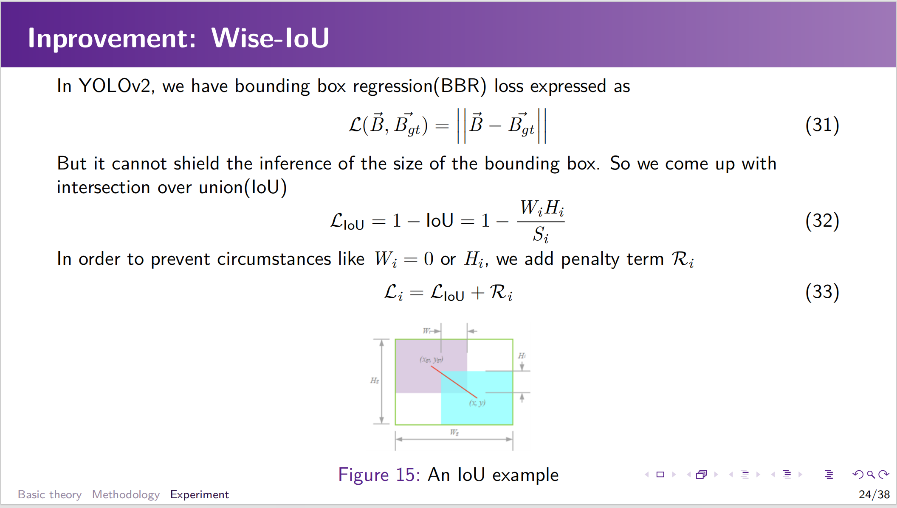

# Kokura-Beamer：一个极简主义的毕业答辩Beamer模板

灵感来自于[这里](https://github.com/thomas10011/WHU-Beamer)，但是我个人感觉那个模板有点过于花哨，所以我按照自己本科答辩PPT的风格写了这个模板。

该模板主要用于组会、报告、答辩等场景，代码中给出的例子是武汉大学，但是也可以根据自己的需求更换学校logo。

- [Kokura-Beamer：一个极简主义的毕业答辩Beamer模板](#kokura-beamer一个极简主义的毕业答辩beamer模板)
  - [相较于PPT，Beamer模板有哪些优势？](#相较于pptbeamer模板有哪些优势)
  - [模板页面展示](#模板页面展示)
  - [使用方法](#使用方法)
    - [环境配置](#环境配置)
    - [编译](#编译)
    - [本项目的文件夹结构说明](#本项目的文件夹结构说明)
  - [TODO](#todo)

## 相较于PPT，Beamer模板有哪些优势？

1. 代码化，更加方便修改
2. 不需要使用Office软件，可以在Linux下使用
3. 使用者只需要关注内容，不需要关注排版，从PPT操作上解放出来

## 模板页面展示










## 使用方法

### 环境配置

首先需要安装latex环境，推荐使用texlive，具体安装方法可以参考[这里](https://www.tug.org/texlive/doc/texlive-zh-cn/texlive-zh-cn.pdf)。

如果已经是texlive用户，直接clone本项目，将相关部分内容修改为自己的内容即可。

### 编译

当完成了讲义修改之后，需要使用xelaTeX编译（其他引擎有待验证）。不少latex编辑器原生支持xelaTeX编译，例如TexStudio，如果使用的是命令行，可以使用如下命令进行编译：

```bash
xelatex main.tex
```

### 本项目的文件夹结构说明

+ `main.tex`：主文件，其中规定了文档结构、包引入等，用于编译
+ `previews`：`readme.md`中的预览图片，用户可直接删掉
+ `images`：存放讲义中引用的图片素材的文件夹
+ `sections`：存放讲义中的各个章节的文件夹，用户可以根据自己的需要添加或删除章节，同时需要在`main.tex`中添加或删除对应的`\include{}`命令
+ `background.png`：讲义的背景图片，仅用于标题和致谢页面，用户可以根据自己的需要更换
+ `logo.png`：讲义的logo图片（武大校徽），仅用于标题页面，用户可以根据自己的需要更换
+ `beamerthemeKokura.sty`: 该模板的主题文件，除非需要高度自定义，否则不建议修改

## TODO

+ [ ] 考虑添加参考文献页面
+ [ ] 自定义一些用于展示信息的组件环境
+ [ ] 调整caption格式
